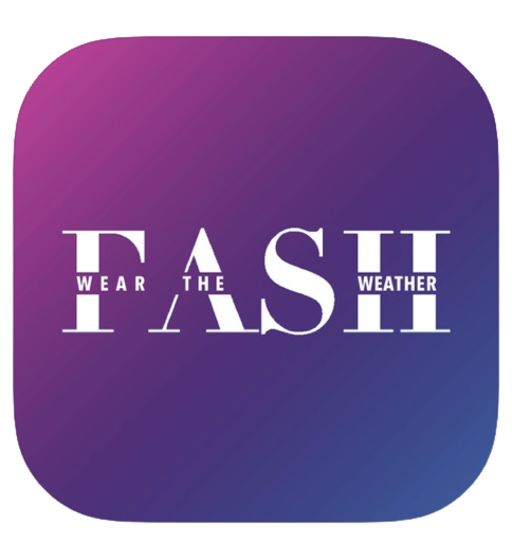

# Prography 5th Fash

## Weather based AI style coordination recommendation App (Deep Learning, iOS)

2019 Fall & Winter IT union club [Prography](https://prography.org/), 5th, project. In this work, we develop and deploy the weather based AI style coordination recommendation iOS App called “Fash”.   
</img>

“Fash” creates a virtual personal wardrobe based on the images of clothes uploaded by the user and employs a classification model to help categorize styles when adding clothes to the closet. To train the model, we manually crawled and labeled over 1,000 images. We attempted to use the JIT model to run the pretrained model directly on the device.

 Based on the virtual personal wardrobe, “Fash” provides style recommendations for clothing coordination according to today’s weather. The weather information (lowest/highest temperature of the day, rain or snow) was obtained through Korea Meteorological Administration (기상청) API.

- Development stacks: Pytorch, Django, iOS

## Poster
</img>

## Prototype design
[Figma](https://www.figma.com/proto/eTGKE5DjiH6T9d894y7VS9/deepfashion?node-id=0-68&starting-point-node-id=0%3A68&mode=design&t=1sRl8hK17B6lxfd5-1)